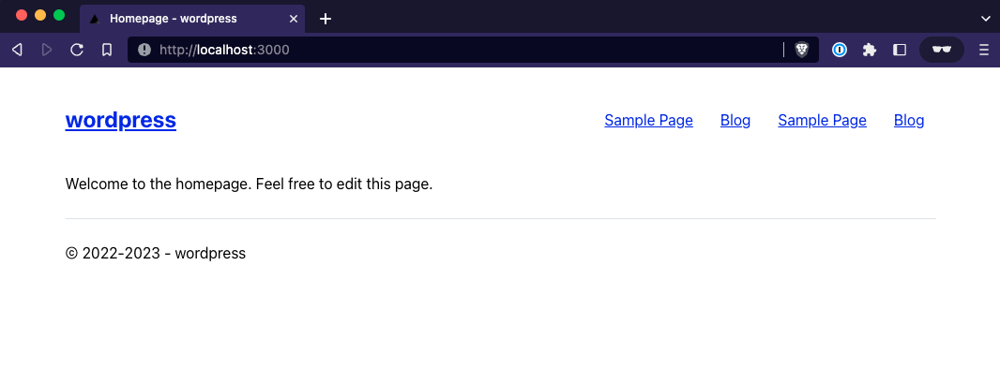
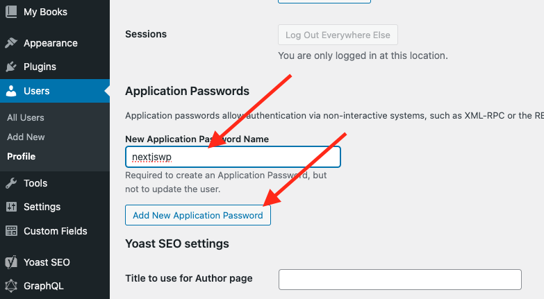
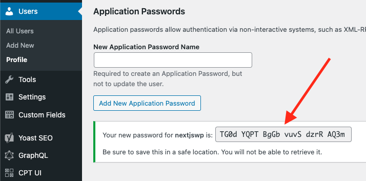
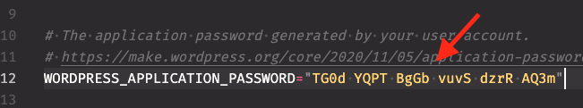
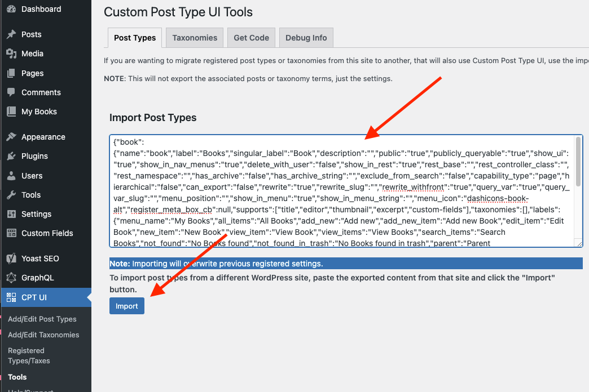
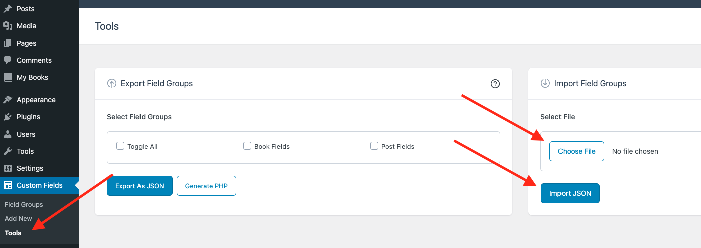

# Setup <!-- omit in toc -->

The following will help you setup Next.js WordPress.

## Table of Contents <!-- omit in toc -->

- [Requirements](#requirements)
- [Quick Start](#quick-start)
  - [Prequisites](#prequisites)
- [Manual Setup (Next.js)](#manual-setup-nextjs)
  - [ENV Variables](#env-variables)
- [Manual Setup (WordPress)](#manual-setup-wordpress)
  - [Install](#install)
  - [3) Log into WordPress](#3-log-into-wordpress)
  - [4) Create Application Password](#4-create-application-password)
  - [5) Import Book CPT](#5-import-book-cpt)
  - [6) Import ACF Fields Groups](#6-import-acf-fields-groups)
- [Start Next.js Development Server](#start-nextjs-development-server)
- [Up Next](#up-next)

## Requirements

- [Docker Desktop](https://www.docker.com/products/docker-desktop)
- [Node](https://nodejs.org/en/)
- [Composer](https://getcomposer.org/download/)

---

## Quick Start

The following will attempt to setup your dev environment for you. If you run into any issues, please refer to the Manual Setup section.

### Prequisites

- [Docker Desktop](https://www.docker.com/products/docker-desktop/) is installed and running
- [Node](https://nodejs.dev/) is installed
- [Composer](https://getcomposer.org/download/) is installed

- Clone this repo:

```bash
npx degit gregrickaby/nextjs-wordpress nextjs-wordpress
```

- Set up your dev environment:

```bash
npm run setup
```

- While the script is running, you will be prompted to log into WordPress and manually import the ACF fields. Follow [these instructions](#6-import-acf-fields-groups).

- When the script completes you should be able to view the frontend:



---

## Manual Setup (Next.js)

### ENV Variables

From inside the `/apps/nextjs/` directory, copy `.env.sample` to `.env.local`

```bash
cp .env.sample .env.local
```

That's it for now. You're ready to move on to the WordPress setup.

---

## Manual Setup (WordPress)

⚠️ [Docker Desktop](https://www.docker.com/products/docker-desktop) needs to be installed and running.

---

### Install

From inside the `/apps/wordpress/config` directory, run the following command:

```bash
chmod +x install.sh && ./install.sh
```

This script pulls down and starts each container. Composer will download the required plugins, WordPress will be configured via a WP-CLI script.

---

### 3) Log into WordPress

View the WordPress dashboard at: <http://localhost:8888/wp-admin/>

- username `admin`
- password `password`

---

### 4) Create Application Password

In order for Next.js to `POST` data back to WordPress, it needs to authenticate using an application password.

1. Navigate to your Profile page in the WordPress dashboard under `Users --> Profile`
2. Scroll down to the Application Password section
3. Type any name to the New Application Password Name field
4. Click the "Add New Application Password" button: 
5. Copy the password that was generated and paste into `.env`: 
6. Open the `.env` file in the _root_ of this project
7. Paste the Application Password next to the `WORDPRESS_APPLICATION_PASSWORD` key: 

---

### 5) Import Book CPT

1. Visit the CPT UI tools page: <http://localhost:8888/wp-admin/admin.php?page=cptui_tools>

2. Paste the contents of `/apps/wordpress/config/cptui-post-type.json` "Import Post Types" field.

3. Click the "Import" button.



---

### 6) Import ACF Fields Groups

In order for post reactions to work, you'll need to import the ACF fields for the Book CPT and Posts.

1. Navigate to the WordPress dashboard under `Custom Fields --> Tools`
2. Under "Import Field Groups" click the "Choose File" button and select the `acf-post-fields.json` file from the `/wordpress` directory: 
3. Click the "Import JSON" button

4. Under the Import settings, click "choose file" and select `/apps/wordpress/acf-cpt-fields.json`

5. Click the blue "Import" button again

That's it! WordPress should now be setup and now you can start Next.js.

---

## Start Next.js Development Server

From the root of the project, run the following command:

```bash
npm run dev
```

Visit <http://localhost:3000> to view the Next.js site:


---

## Up Next

Learn more about [Local Development](development.md)

---
